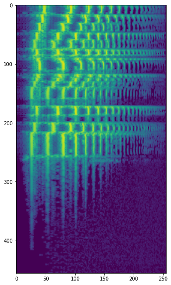
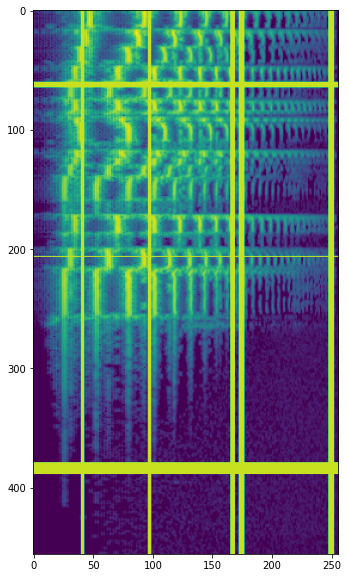

# Theory

This library contains an implementation of [SpecAugment](https://arxiv.org/abs/1904.08779), a simple data 
augmentation technique for speech recognition. Following the [kapre](https://github.com/keunwoochoi/kapre) philosophy,
the implementation of this method has been encapsulated in a custom layer of 
Tensorflow, so that it can be incorporated into our neural network architectures directly.

# Install Package

To install the package execute the following command.

```
pip install spec-augment
```

# Usage

```
SpecAugment(freq_mask_param=5, time_mask_param=10)

SpecAugment(freq_mask_param=5, time_mask_param=10, n_freq_mask=5, n_time_mask=3)

SpecAugment(freq_mask_param=5, time_mask_param=10, n_freq_mask=5, n_time_mask=3, mask_value=0)
```

# Arguments

- **freq_mask_param** - Frequency Mask Parameter (F in the paper)
- **time_mask_param** - Time Mask Parameter (T in the paper)
- **n_freq_mask** - Number of frequency masks to apply (mF in the paper). By default is 1.
- **n_time_mask** - Number of time masks to apply (mT in the paper). By default is 1.
- **mask_value** - Imputation value. By default is zero.

# Example

SpecAugment is a technique applicable to spectrograms. In the following example, kapre is used to compute
the Mel Spectrogram of a sample audio from Librosa.

```
import tensorflow as tf
from tensorflow.keras.models import Sequential
import librosa
import kapre
from spec_augment import SpecAugment

filename = librosa.ex('trumpet')
y, sr = librosa.load(filename)

audio_tensor = tf.reshape(tf.cast(y, tf.float32), (1, -1, 1))
input_shape = y.reshape(-1, 1).shape


melgram = kapre.composed.get_melspectrogram_layer(input_shape=input_shape,
                                                  n_fft=1024,
                                                  return_decibel=True,
                                                  n_mels=256,
                                                  input_data_format='channels_last',
                                                  output_data_format='channels_last')
```

Now we instantiate the SpecAugment layer. We are using an F of 5 (freq_mask_param), a T of 10 (time_mask_param), 
5 frequency masks (n_freq_mask) and 3 time masks (n_time_mask). We will use a mask_value of -100.

```

# Now we define the SpecAugment layer
spec_augment = SpecAugment(freq_mask_param=5,
                           time_mask_param=10,
                           n_freq_mask=5,
                           n_time_mask=3,
                           mask_value=-100)                 
model = Sequential()
model.add(melgram)
model.add(spec_augment)

model.summary()
```

Let's see the transformation applied to the Mel Spectrogram.

Original Mel Spectrogram



Transformed Mel Spectrogram




# References

https://arxiv.org/abs/1904.08779


